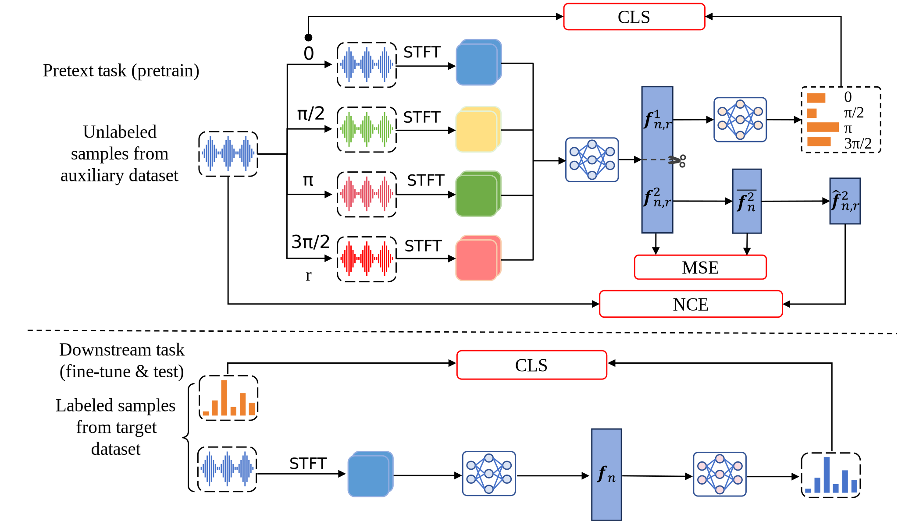

## FS-SEI Based on PSPD
* The code corresponds to the paper "[Enhanced Few-Shot Specific Emitter Identification via Phase Shift Prediction and Decoupling](https://ieeexplore.ieee.org/document/10614374)".
```
@ARTICLE{10614374,
  author={Xu, Lai and Fu, Xue and Wang, Yu and Zhang, Qianyun and Zhao, Haitao and Lin, Yun and Gui, Guan},
  journal={IEEE Transactions on Cognitive Communications and Networking}, 
  title={Enhanced Few-Shot Specific Emitter Identification via Phase Shift Prediction and Decoupling}, 
  year={2025},
  volume={11},
  number={1},
  pages={145-155},
  keywords={Task analysis;Feature extraction;Physical layer;Clustering algorithms;Authentication;Estimation;Wireless communication;Specific emitter identification (SEI);few-shot learning;self-supervised learning;rotation prediction},
  doi={10.1109/TCCN.2024.3435886}}
```
* This is the journal version of the [conference paper](https://ieeexplore.ieee.org/document/10419686/) and an improvement and upgrade of the RFD project.

## Contact
* E-mail: [2025011313@njupt.edu.cn](mailto:2025011313@njupt.edu.cn).

## Requirement


## Deployment
* `pretext.py` is used for pretraining. For example , you can execute `python pretrain.py -e ResNet18 ` to get a pretrained encoder.

* `finetune.py` is used for finetuning. For example , you can execute `python finetune.py -e ResNet18 -s 5 ` to finetune the encoder and train a classifier for 5-shot case.  If you want to artificially add noise of a specified SNR (e.g. 10dB) during the test phase, you can execute `python finetune.py -e ResNet18 -s 5 --snr 10`.

* The usage of `baseline.py` is similarly to `finetune.py`.

## Framework


## Dataset
* The dataset we used is from [https://genesys-lab.org/oracle](https://genesys-lab.org/oracle).
* We cut this 16-class Wi-Fi dataset into 2 different datasets. Specifically, we divide the first 10 classes as
  an auxiliary dataset for pretext task, and the last 6 classes as a few-shot dataset for downstream task.
* Info of the dataset is displayed in the `Subsection A` of `Section V` in our paper.

## Performance
* The performance of our method is demonstrated in `Subsection B` to `Subsection G` of `Section V` in our paper.

