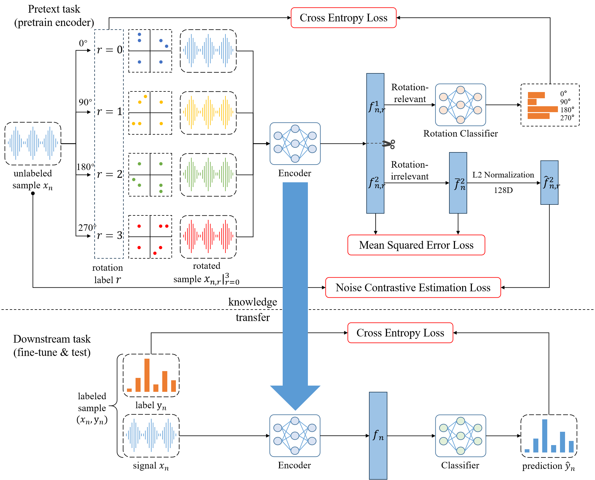

## FS-SEI Based on RFD
* The code corresponds to the paper "Few-Shot Specific Emitter Identification Method Using Rotation Feature Decoupling for Secure 6G".
* The "[main-experiment](./main-experiment)" folder is used for pretext task and downstream task.
* The "[ablation-experiment](./ablation-experiment)" folder is used for verifing the impact of mini-target in pretext task to downstream task.

## Contact
* E-mail: [geminixl615@gmail.com](mailto:geminixl615@gmail.com).

## Requirement
* [Python](https://www.python.org/) 3.8.5  
* [PyTorch](https://github.com/pytorch/pytorch) 1.11.0

## Framework

## Dataset
* The dataset we used is from [https://genesys-lab.org/oracle](https://genesys-lab.org/oracle).
* We cut this 16-class WiFi dataset into 2 different datasets. Specifically, we divide the first 10 classes as
an auxiliary dataset for pretext task, and the last 6 classes as a few-shot dataset for downstream task.
* Info. of the dataset is displayed in the following table.

| Parameters | Value |
| :---: | :---: |
|Dataset | WiFi |
|Standard | [IEEE 802.11a](https://standards.ieee.org/ieee/802.11a/1165/) |
|Dimension | (2, 6000) |
|Format | I/Q |
|Center frequency | 2.45 GHz |
|Sample rate | 5 Mbps |
|Transmitter | 16 USRP X310 |
|Receiver | 1 USRP B210 |
|Distance between transmitters | 6 in feet |
|Distance between transmitter and receiver | 62 in feet |

## Performance
<!-- * FS-SEI based on RFD  
  
* FS-SEI without pretrain  
  
* Average Line Chart: FS-SEI based on RFD VS FS-SEI without pretrain  
  
* Abaltion experiment  
 -->
The performance of our method is demonstrated in `subsection B` and `subsection C` of `section IV` in our paper.
